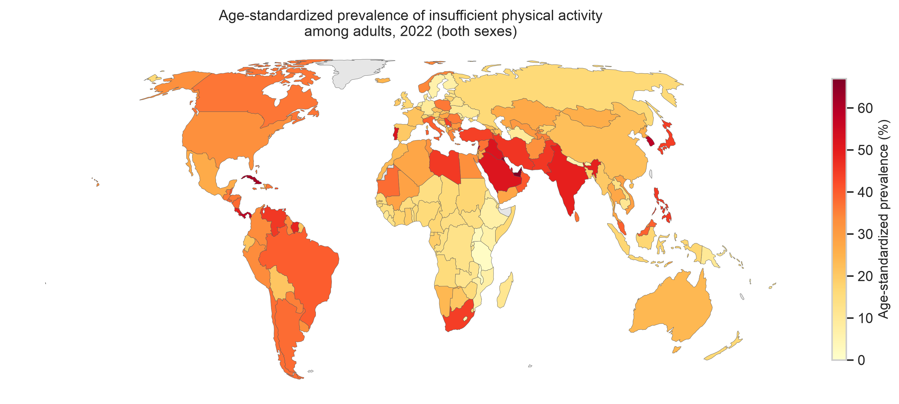
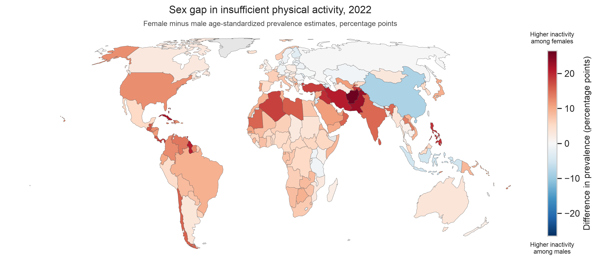
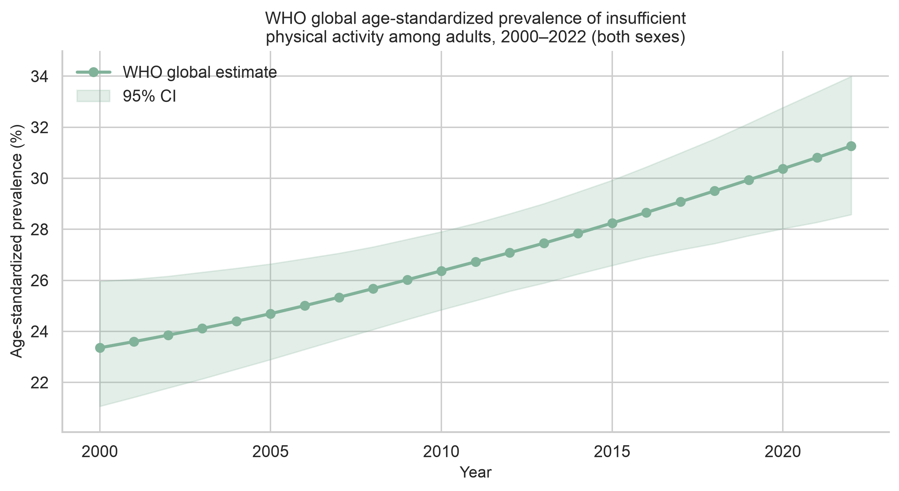

# Global Patterns in Insufficient Physical Activity

This project analyzes World Health Organization (WHO) Global Health Observatory estimates of insufficient physical activity among adults, using Python to prepare a reproducible dataset and describe country, sex, regional, geographic, and global patterns.

The indicator is **Physical activity, insufficient, among adults aged 18+ years, prevalence (age-standardized estimate) (%)**, WHO code `NCD_PAA`. Values are modeled age-standardized prevalence estimates, not crude survey rates. Cross-sectional country comparisons use **2022**, the latest year in this extract.

## Purpose

The analysis describes:

- country-level variation in insufficient physical activity;
- differences between female and male estimates;
- differences across WHO regions;
- geographic patterns in 2022;
- the WHO global series from 2000 to 2022.

It is a descriptive analysis of published GHO estimates, not a full epidemiological study of physical activity.

## Analytical approach

1. Load a pinned WHO GHO extract (optional live API refresh).
2. Clean and validate geography, sex, year, and prevalence fields.
3. Export a processed analysis table.
4. Summarize the 2022 country cross-section (195 countries).
5. Compare estimates by sex and WHO region.
6. Examine the WHO global trend, 2000–2022.
7. Map 2022 country-level prevalence.
8. Derive and map the female–male difference in prevalence.

## Key findings

**Country-level averages give each country equal weight, regardless of population size.** Each of the 195 countries contributes one national estimate, so a small country and a very populous country count once each. These averages describe how estimates vary across countries; they are not estimates of prevalence in the world’s total population. For the global trend, the analysis therefore uses the WHO’s separately modeled global estimates.

- Across the **195 countries** in the dataset, the average age-standardized prevalence estimate in 2022 was about **27.3%**.
- Country estimates averaged about **31.0% for females** and **23.6% for males**.
- Average country estimates were highest in the **Eastern Mediterranean** and the **Americas**, and lowest in **Africa**.
- The WHO’s global modeled estimate increased from about **23.4% in 2000** to **31.3% in 2022**.
- Female estimates were higher than male estimates in **169 of 195 countries**; the reverse was observed in **26 countries**. These are descriptive differences and are not statistical significance tests.

## Visual highlights

### Global prevalence in 2022



Country-level WHO estimates for 2022, both sexes. Higher values appear in parts of the Eastern Mediterranean and the Americas; many African countries with a drawn polygon are toward the lower end of the scale.

### Female–male difference in 2022



`difference = female prevalence − male prevalence`, in **percentage points**. Positive values indicate higher estimated insufficient physical activity among females; negative values indicate higher estimates among males. The scale is centered at zero.

### WHO global trend, 2000–2022



Official GHO global series (`spatial_type == "Global"`), not an unweighted average of the 195 country rows.

Distributions by country, sex, and region, plus ranked sex-gap tables, are in `notebooks/02_EDA_who_physical_inactivity.ipynb`.

## Geographic coverage

WHO estimates are available for all **195** countries in the 2022 analytical dataset. The choropleths use [Natural Earth](https://www.naturalearthdata.com/) 110m Admin 0 country polygons. That generalized geometry omits **28** small states and island countries, which therefore do not appear on the maps. Those countries remain in all statistical analyses and ranked tables. Absence from a map does not mean missing WHO data.

Grey areas on the maps are Natural Earth polygons without a matching WHO country observation in this dataset.

## Repository structure

```text
.
├── data/
│   ├── raw/          # pinned WHO extract and country-name CSV
│   ├── processed/    # cleaned analysis table
│   └── external/     # Natural Earth 110m country boundaries
├── notebooks/
│   ├── 01_data_preparation_who_physical_inactivity.ipynb
│   └── 02_EDA_who_physical_inactivity.ipynb
├── figures/
├── environment.yml
└── README.md
```

**01 — Data preparation.** Load the pinned WHO extract (or optionally refresh from the GHO API), validate fields, and write `data/processed/who_physical_inactivity_clean.csv`.

**02 — Exploratory analysis.** 2022 country descriptive statistics; sex and WHO-region comparisons; world choropleths; female–male difference; WHO global trend, 2000–2022.

## Reproducibility

```bash
conda env create -f environment.yml
conda activate who-activity-ana
jupyter lab
```

Run the notebooks in order:

1. `notebooks/01_data_preparation_who_physical_inactivity.ipynb`
2. `notebooks/02_EDA_who_physical_inactivity.ipynb`

Notebook 01 uses the pinned snapshot `data/raw/who_ncd_paa.json` by default (`REFRESH_FROM_API = False`), so a full run does not require a live WHO request. Set that flag to `True` only to download a newer extract; the pinned file is not overwritten.

## Sources

**World Health Organization.** Global Health Observatory indicator `NCD_PAA` (age-standardized prevalence of insufficient physical activity among adults aged 18+ years). [Indicator page](https://www.who.int/data/gho/data/indicators/indicator-details/GHO/prevalence-of-insufficient-physical-activity-among-adults-aged-18-years-(age-standardized-estimate)-(-)) · [GHO OData API](https://www.who.int/data/gho/info/gho-odata-api) (`https://ghoapi.azureedge.net/api/NCD_PAA`). This repository does not restate a WHO data license.

**Natural Earth.** [Admin 0 – Countries](https://www.naturalearthdata.com/downloads/110m-cultural-vectors/), 110m, version 5.1.1. Natural Earth data are in the public domain. Source files and version information are in `data/external/ne_110m_admin_0_countries/`.

## Limitations

- Values are WHO modeled, **age-standardized** estimates, not crude prevalence from survey microdata.
- Country means and regional country averages are **unweighted** and are not equivalent to the WHO global (or regional) population-level estimate.
- Female–male gaps are descriptive percentage-point differences, not hypothesis tests. Separate male and female confidence intervals do not provide an interval for Female − Male.
- Natural Earth 110m omits 28 small states and island countries from the choropleths; those countries remain in the tables.
- The analysis is descriptive and does not establish causes of geographic or sex differences.

## Technologies

Python, pandas, Matplotlib, Seaborn, GeoPandas, Jupyter.
